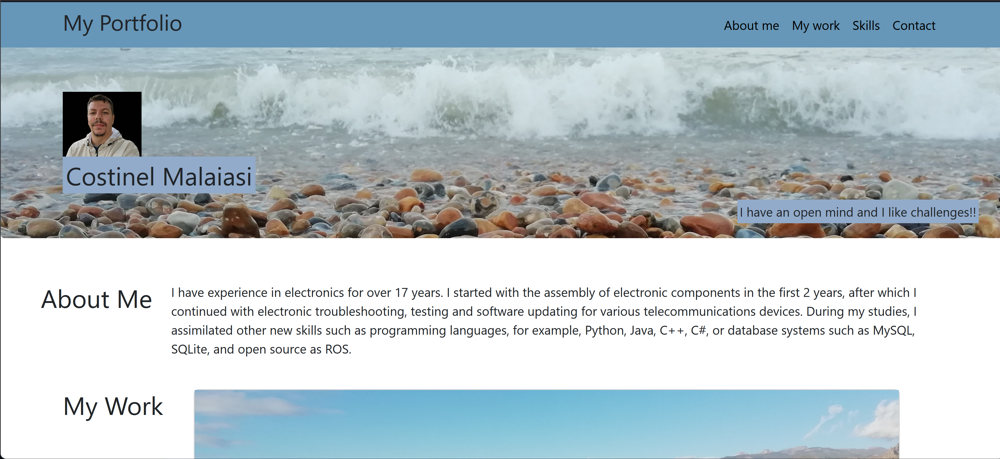
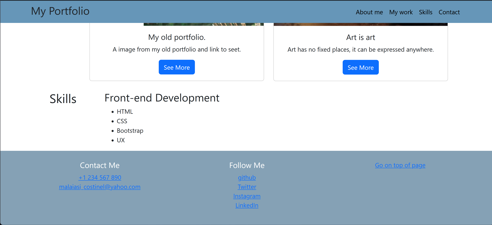

# Bootstrap-Portfolio

## Description

 This portfolio was created to increase the chances of finding a job in this field.
 This project contains part of HTML, CSS and together with the Bootstrap libraries the web pages are built faster.
 I managed to create a portfolio much faster and more systematized than before using bootstramp.
 I have accumulated more knowledge about HTML and CSS, but also the fact that using certain specially dedicated libraries you can build a web page more easily and better.

## Installation

https://costinel22.github.io/Bootstrap-Portfolio/#top-of-page

## Usage

  
## Credits

https://getbootstrap.com/docs/5.0/components/navbar/

## License

Mit licence

## Tests

Go the extra mile and write tests for your application. Then provide examples on how to run them here.