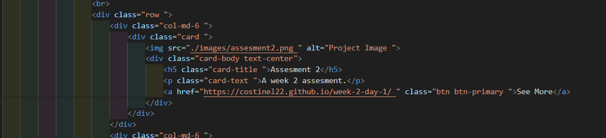

# Bootstrap-Portfolio

## Description

 - This portfolio was created to increase the chances of finding a job in this field.
 - This project contains part of HTML, CSS and together with the Bootstrap libraries the web pages are built faster.
 - I managed to create a portfolio much faster and more systematized than before using bootstramp.
 - I have accumulated more knowledge about HTML and CSS, but also the fact that using certain specially dedicated libraries you can build a web page more easily and better.

## Installation

https://costinel22.github.io/Bootstrap-Portfolio/

## Usage
#### A screenshot with the first part of pages that contains the nav and hero part.

#### A screenshot with the last part of the pages containing the footer part.

#### A piece of code illustrating the construction of a card.

  
## Credits

https://getbootstrap.com/docs/5.0/components/navbar/

## License

Mit licence

## Tests

To test the functionality of the pages, press the links in the navbar and from the contacts, as well as the ones next to the pictures with the names see more A piece of code illustrating the construction of a card.
